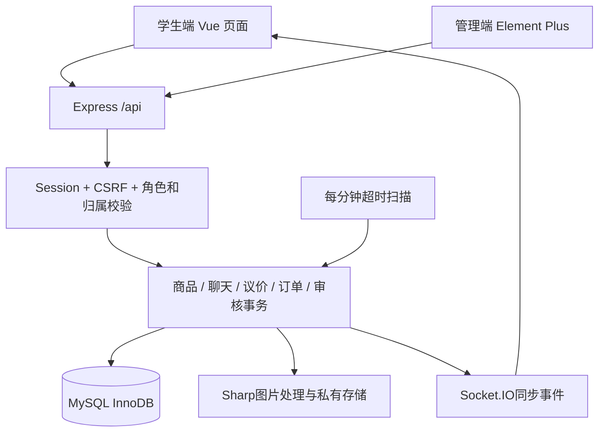

# 西汽闲集实施技术方案

> 历史文档：本文描述早期仅限校内学生的版本。2026-09-28 起的大众手机号账号、访客浏览、同城试点和部署边界以 [大众平台技术方案](大众平台技术方案.md) 及当前代码为准。

版本：2.1；日期：2026-09-23。本文以当前交付的代码为准，补充前一版总体设计，明确已经落地的技术结构、业务规则和扩展边界。

## 1. 产品范围与架构

面向校内学生的二手交易网站，具备普通学生和管理员两类角色。学生同时可买可卖，管理员通过独立后台进行审核管理。首期是一件商品对应一件实物、校内面交和线下付款。

采用一个Vue工程和一个Node后端。管理员页面是独立路由及异步加载代码块，管理员身份不能进入学生交易路由；服务端仍逐接口进行权限检查。两个入口共用一套事务数据库与登录机制，避免重复维护。

## 2. 实际技术栈及目录映射

| 项目     | 当前实现                                                                 |
| -------- | ------------------------------------------------------------------------ |
| 开发语言 | JavaScript ES Modules，Vue SFC，无Java/TypeScript依赖                    |
| 学生端   | Vue 3、Vue Router、Pinia、Axios，定制响应式样式，Vant提示/确认弹窗       |
| 管理端   | 同一Vue工程中的独立Admin页面，Element Plus表格、筛选与对话框             |
| 后端     | Express 5、Zod输入校验、mysql2参数化查询、Argon2id密码摘要               |
| 登录     | express-session + 自定义MySQL Store；CSRF token、Origin校验              |
| 数据库   | MySQL 8.4.11；InnoDB、utf8mb4、UTC会话                                   |
| 图片     | Multer限流量上传、Sharp解码与WebP转换、随机UUID存储名                    |
| 消息     | REST持久化，Socket.IO只通知重新同步，15秒轮询兜底                        |
| 测试     | Node.js内置test runner + Supertest + 真实MySQL；Playwright CLI浏览器验收 |
| 构建     | Vite生产构建；Node提供静态文件与SPA回退                                  |

数据库层在`server/db.js`，会话层在`server/session.js`，HTTP业务与事务在`server/app.js`，实时通信和任务启动在`server/index.js`。前端各业务页面独立位于`src/views`。

相较总体设计，本次没有引入Knex、Pino或多工程workspace。初始表结构以`schema.sql`提供，初始化幂等执行。后续数据库结构升级应新增有版本号的迁移脚本，不能把`CREATE TABLE IF NOT EXISTS`当作已有表升级机制。

## 3. 学号认证与访问控制

管理员录入授权学生名册，输入学号、昵称备注和在校有效期。学生填写名册学号与手机号，请求六位短信验证码，再设置昵称和至少十位密码。验证码摘要、五分钟有效期、重发间隔和错误次数在服务端控制；演示模式显示测试码，正式模式须配置可信短信网关。系统不再要求激活凭证。

名册核验、手机号验证码消费和账号创建在同一事务内完成，防止重复注册。学号为字符串，保留前导零并建立唯一约束；手机号也唯一。可以使用学号或手机号加密码登录。微信网站应用OAuth登录需要先在已认证学生账号的设置页绑定微信OpenID，未绑定的微信身份不能直接进入平台。登录均校验账号状态及认证有效期；普通浏览、图片、收藏、会话和交易接口均要求有效身份。

登录后重新生成SessionID并更新CSRF token。学生会话24小时，管理员8小时。退出与管理员限制账号会删除会话。正式模式Cookie使用HttpOnly、Secure、SameSite=Lax；更改数据请求附CSRF token，且校验浏览器Origin。

后台操作附原因并保存审计日志。学生不能通过伪造请求更改角色、价格归属、订单状态或他人资源。商品响应只展示卖家昵称，不展示其学号与密码摘要。

名册真实性依赖学校授权，手机号和微信都不能单独证明学生身份，这是正式校园准入的外部条件。当前没有连接学校SSO接口，也没有收集真实学生材料。

## 4. 数据模型

实际DDL见`server/schema.sql`，主要关系如下。

| 表                     | 职责                                           | 关键约束                               |
| ---------------------- | ---------------------------------------------- | -------------------------------------- |
| users / roster         | 用户学号、手机号、微信绑定及授权学生名册       | 学号与手机号唯一，名册限一次注册       |
| phone_codes            | 短信验证码摘要、到期与尝试次数                 | 手机号与学号组合唯一                   |
| sessions               | 持久化登录会话                                 | sid主键，可按user_id撤销               |
| categories / locations | 分类与公共交易地点                             | 商品外键引用                           |
| assets / products      | 图片归属与商品字段                             | 图片UUID，卖家外键，金额正整数分       |
| favorites              | 收藏关系                                       | user_id + product_id联合主键           |
| conversations          | 商品与买家对应的会话、消息序列与已读位置       | product_id + buyer_id唯一              |
| messages               | 文本与报价卡片引用                             | 会话序号唯一，发送者＋客户端消息ID唯一 |
| offers                 | 各轮报价金额、双方、状态和到期时间             | 关联会话与商品版本，保留所有旧报价     |
| orders                 | 交易双方、商品快照、实际成交价、约定、截止时间 | 订单号唯一，议价报价只能用于一个订单   |
| product_reservations   | 有效订单对商品的独占预留                       | product_id主键，order_id唯一           |
| idempotency_keys       | 重复下单请求与原订单映射                       | 用户＋请求key唯一，保存请求摘要        |
| order_events           | 状态操作时间线                                 | 订单外键，按ID排序                     |
| reports                | 商品举报、处理状态和结果                       | 举报人可查看自己的处理进度             |
| notifications          | 持久化系统通知                                 | 关联接收用户                           |
| audit_logs             | 管理员动作、对象、原因和时间                   | 业务操作与日志在同一事务中写入         |

BIGINT ID在API中使用字符串。金额保存为整数分，展示时除以100，避免浮点计算定价。数据库会话显式设置UTC，前端按浏览器本地时区展示；本机为北京时间。

本次把商品图集存为JSON数组，把商品快照存为JSON；没有单独的product_images和negotiations表。报价链由同一会话中的offer状态及序列体现，单轮只允许一个有效待回应报价。

## 5. 页面与交互

| 页面      | 路由                | 实际操作                                               |
| --------- | ------------------- | ------------------------------------------------------ |
| 登录/注册 | /login              | 学号或手机号登录、短信注册、微信登录入口、演示账号填入 |
| 校园首页  | /                   | 分类、搜索、筛选、排序、商品卡片、收藏                 |
| 收藏      | /favorites          | 收藏列表、取消收藏、查看当前状态                       |
| 商品详情  | /products/:id       | 图集、描述、价格、卖家、面交地点、聊天、购买、举报     |
| 发布/编辑 | /publish、/edit/:id | 图片上传、必填校验、提交审核                           |
| 消息      | /messages/:id?      | 会话列表、聊天、已读、报价卡片、接受/拒绝/还价/撤回    |
| 订单      | /orders             | 买到/卖出标签、状态操作、面交约定、时间线              |
| 我的      | /me                 | 我的发布、订单入口、通知、举报结果、退出               |
| 账号设置  | /settings           | 修改昵称与密码、绑定或解除微信、查看身份信息           |
| 管理中心  | /admin              | 概览、商品、学生、订单、举报、日志六个工作区           |

视觉采用黄白主色、低饱和绿色辅助色、商品图片优先的双列/多列布局。手机端显示底部五项导航；桌面端显示顶部导航。管理界面使用侧栏＋表格，操作需在对话框中填写原因。

## 6. 商品审核与交易状态

商品：`PENDING_REVIEW → ON_SALE → RESERVED → SOLD`。编辑在售商品重新变为待审核，并递增version。拒绝为REJECTED，主动下架为OFF_SHELF，管理员下架为REMOVED。

待审核商品及其图片对其他学生不可见。审核必须匹配商品version，防止管理员审核的是旧描述。交易中/已售商品不允许编辑关键内容；已下架商品通过编辑和重新审核恢复上架。

订单：`PENDING_ACCEPT → AWAITING_MEETUP → AWAITING_RECEIPT → COMPLETED`。卖家接单等同于接受买家提交的面交时间与地点。买家和卖家可通过聊天协商；本次没有独立“修改约定提议单”，需要更改订单约定时在交付前取消并重新下单。

交付前可取消并填写原因；卖家拒单或24小时未接单释放商品。交付后不能单方取消，改走DISPUTED。管理员核实后完成或关闭争议订单；关闭时商品保持下架，防止未厘清归属即重卖。

## 7. 议价与一致性

报价状态：PENDING、ACCEPTED、REJECTED、WITHDRAWN、SUPERSEDED、EXPIRED、INVALIDATED、USED。

首次报价由买家发起，必须低于标价；接收者可以接受、拒绝或还价，发出者可以撤回待回应报价。还价生成新记录并使旧报价SUPERSEDED。接受后的议定价仅供该买家使用，有效30分钟；所有请求由服务端即时检查到期时间。

接受报价不预留商品。下单事务锁定商品行，读取合法原价或已接受报价，创建订单快照与预留记录，消费报价并使其他报价失效，同时写入订单事件和通知。任何步骤失败回滚。

`product_reservations.product_id`唯一约束是第二道并发保护。`Idempotency-Key`与请求摘要保证网络重试返回原订单；同key更换请求内容返回409。服务端拒绝客户端自行提交成交金额。

取消、超时关闭、确认收货都在事务中校验订单状态与预留归属。完成时商品SOLD且释放预留，SOLD商品不能重新购买。报价/接单超时任务每分钟运行，重启后按数据库截止时间继续处理。

## 8. 消息与图片

聊天通过REST写数据库，Socket.IO仅发送sync事件。每个消息有会话序列号；重复clientMessageId不会重复插入。客户端收到推送或重连时重读会话，并每15秒补偿同步。接口支持after序号，当前页面读取最多500条；更长历史的完整分页和聊天图片发送属于后续扩展。

上传只允许一张不超过5MB的JPEG/PNG/WebP，实际解码校验后转换WebP，去除EXIF，限制最大像素。图片通过带认证接口读取，不能直接访问uploads目录；发布时校验每张图归当前用户所有。

## 9. 部署、验证与扩展

本机Node服务3088、独立MySQL3308；配置与随机密钥存`.env`，运行文件在`.runtime`，不纳入版本控制。Windows启动脚本检测健康状态，避免重复启动Node。

自动化集成测试使用独立`xiqi_market_test`。浏览器验收使用不同会话模拟买家、卖家和管理员。构建、依赖审计和浏览器截图见验收记录。

正式部署需完成HTTPS、真实名册发放、后台管理员治理、备份恢复与容量压测。本版未宣称完成学校SSO、短信找回、线上支付、私有认证材料上传审核、批量名册导入、分类/地点在线编辑、跨校交易和生产容灾。

后续可按业务量拆分Express领域路由，加入版本化迁移、日志采集、完整列表分页和多实例任务协调；这些扩展不改变现有订单预留与身份权限规则。
